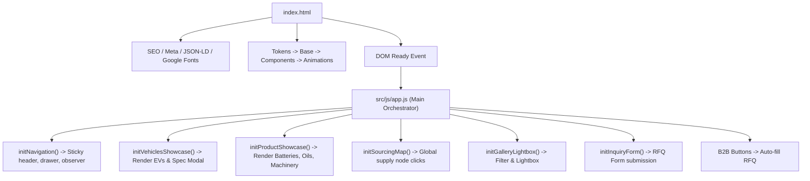
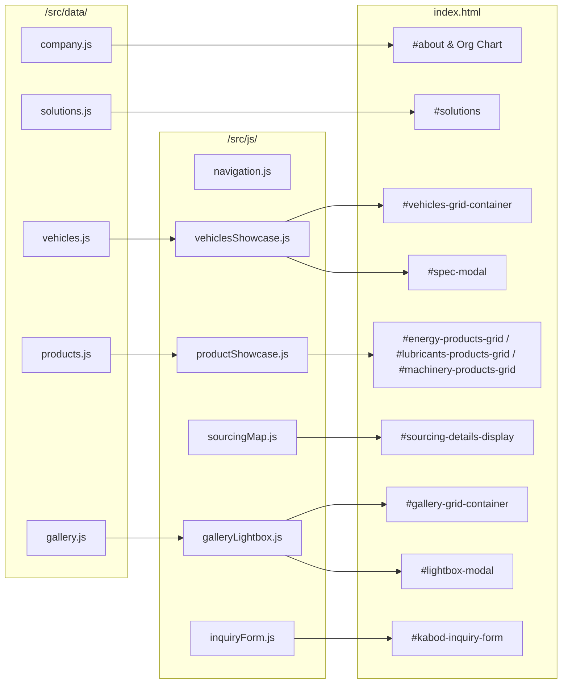
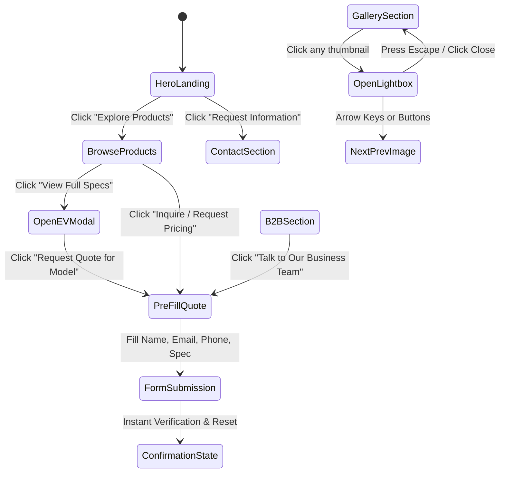

# Kabod Motors Corporate Website — System & Architecture Map

## 1. Application Entry Point & Lifecycle



---

## 2. Component & Section Hierarchy

```
index.html (Single Page Corporate Platform)
│
├── <header class="site-header" id="site-header">
│   ├── .brand-logo ("KABOD MOTORS - Quality Without Compromise")
│   ├── .nav-desktop (Desktop Navigation Links)
│   ├── .nav-actions (Request Quote CTA + Hamburger trigger)
│   └── .mobile-drawer (Slide-out navigation drawer with touch links)
│
├── <section class="hero-section" id="hero">
│   ├── .hero-content (Trust tag, H1 title, Subtitle, Dual CTAs)
│   ├── .hero-pillars-strip (4 Historical & Strategic Pillars)
│   └── .hero-media-wrapper (.hero-image-card with BYD Yangwang U8)
│
├── <section class="credibility-strip" id="trust-strip">
│   └── .credibility-grid (5 Verified credibility cards)
│
├── <section class="section" id="about">
│   ├── .about-grid (Capital progression, Vision, Mission, Core Values)
│   └── .org-chart-wrapper (Company Governance & Directorate Framework)
│
├── <section class="section section-darker" id="solutions">
│   └── .solutions-grid (6 Capability Pillar Cards: EVs, Batteries, Oils, Machinery, Import, Supplies)
│
├── <section class="section" id="products">
│   ├── .product-tabs (EVs | Maxtorm Batteries | Koryo Lubricants | Heavy Machinery)
│   ├── #vehicles-panel (.vehicles-grid populated from vehicles.js)
│   ├── #energy-panel (#energy-products-grid populated from products.js)
│   ├── #lubricants-panel (#lubricants-products-grid populated from products.js)
│   └── #machinery-panel (#machinery-products-grid populated from products.js)
│
├── <section class="section b2b-section" id="b2b-solutions">
│   └── .b2b-banner (Enterprise Fleet, Construction, Industrial & Transport Sourcing Hub)
│
├── <section class="section" id="sourcing">
│   └── .sourcing-map-card (Interactive nodes: South Korea, China, UAE, Ethiopia)
│
├── <section class="section section-darker" id="gallery">
│   ├── .gallery-filter-bar (All | EV | Machinery | Energy | Lubricants | Cockpit)
│   └── .gallery-grid (40 Cataloged assets)
│
├── <section class="section" id="contact">
│   ├── .inquiry-form-card (#kabod-inquiry-form with multi-category selection)
│   └── .contact-info-cards (Verified Addis Ababa HQ, Phone, Fax, Email, UAE Sister Co.)
│
├── .spec-modal (#spec-modal - Vehicle Technical Data Sheet Drawer)
├── .lightbox-modal (#lightbox-modal - High-Res Image Inspection Modal)
│
└── <footer class="site-footer">
    ├── .footer-top-grid (Company branding, Solutions, Products, HQ details)
    └── .footer-bottom (Copyright & Technical disclaimer)
```

---

## 3. Data Flow Architecture



---

## 4. User Interaction & CTA Flow



---

## 5. Form & Lead Generation Flow

1. **Trigger Sources**:
   - Navigation button (*"Request Quote"*) -> Smooth scrolls to `#contact`.
   - Vehicle cards (*"Inquire"*) -> Prefills dropdown to `"Electric Vehicles"` and populates message textarea with vehicle model name.
   - Product cards (*"Inquire / Request Pricing"*) -> Prefills dropdown to matching category (e.g. `"Batteries / Energy"` or `"Lubricants"`) and sets product inquiry text.
   - B2B cards (*"Talk to Our Business Team"*) -> Prefills dropdown to `"Industrial Products"` with enterprise procurement template message.
   - Modal drawer (*"Request Quote for [Model]"*) -> Closes modal and scrolls directly to prefilled contact form.
2. **Validation**: Checks for non-empty Full Name, Phone, Email, and Message.
3. **Feedback**: Renders success message confirmation and resets form fields.
